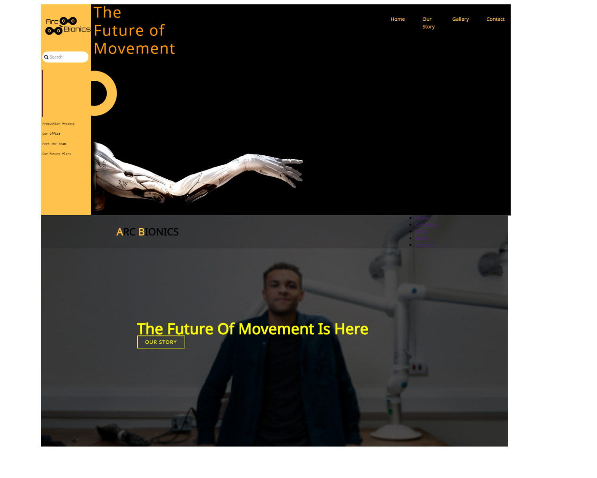

<h1 align="center">Arc Bionics</h1>

<h2 align="center"></h2>

# Table of Contents 

1. [Project Introduction](#introduction)
2. [UX](#ux)
3. [Design Choices](#designchoices)
4. [Wireframes](#wireframes)
5. [Features](#features)
6. [Technologies Used](#techused)
7. [Testing](#testing)
8. [Known Bugs](#knownbugs)
9. [Deployment](#deployment)
10. [Credits](#credits)
11. [Acknowledgements](#acknowledgements)

## Project Introduction 
My Project here is centred around the name of the website which is Arc Bionics. It's mainly designed and catered to
amputees who are suffering with a possibility of having no replacement or options for another arm or a leg, thus making 
it easiy accessible for them to invest in a bionic limb that functions the same as an human limb.

I wanted this project/website to be special as this is something i do take in a passionate manner as I have a relative who
has a similar situation and does not have any access to a bionic arm, so this was the main inspiration behind this website of mine.

I had taken quite a substantial amount of time as to how i could bring a design like this into action and turn it into a website.
In the UX section below you will be able to see this.

To view my live website, please click onto this below:

[View the live project here.](https://shazaiib47.github.io/arc-bionics-new/)

## User Experience (UX) 

-   ### User Stories

    - ### First Time Visitor Goals

        1. As a First Time Visitor, I want to easily learn the purpose of the site and more about the organisation.
        2. As a First Time Visitor, I want to easily navigate through the site to find content.
        3. As a First Time Visitor, I want to navigate the social links of the organisation to determine how known they are.
        4. As a First Time Visitor, I want to be able to see a company logo located within the website.
        5. As a First Time Visitor, I want to be able to use a form to contact the site for any queries in relation to bionics.

    - ### Site Owner Goals

        1. As a Site Owner, I want to create a very interactive website with links to allow the user to grasp clearly what is going on.
        2. As a Site Owner, I want the user to be able to submit a query using a form provided to get in contact with the company.
        3. As a Site Owner, I want the user to clearly make their way around the website with the links given as well as the social links.
        4. As a Site Owner, I want the user to be able to communicate with the company through the social links given.
        5. As a Site Owner, I want the user to view images clearly and to be able to view what the main purpose of the site is.

## Design Choices 

- ### Website Drafts
<h2 align="center"></h2>

- Originally before the creation of this website, I had multiple ideas as to how i would want my website to be like.

- Above, you can see 2 drafts I had made mid website development but given the span of my website, I had given up on these 2 plans
  as it would make it too complicated for me as a first project and did not want to confuse the user with it.

- The ethos shown across the second draft image was customised in a way where it would sweep across the screen in a smooth manner.

- *Note: These 2 draft website plans were created before this final product and had been kept on the side to take inspiration from*

- ### Font Selection 

    - I had chosen a universal font to be used across the whole of the website as this made styling easy and had fit in well with the theme of my website.
      The Font I had chosen was [Noto Sans](https://fonts.google.com/specimen/Noto+Sans?query=noto+sa)

- ### Colour Choice 

    - When considering the colour theme of my website in the pre planning phase, I had to choose a theme that combined colours effortlessly
      and ensure that there would be no confusion so the user does not get distracted by the colours used. 

      The Images and text colour had contrasted the theme of the logo and website well, so I had chosen a mix of colours which include; Black, White, Grey and 
      a shade of yellow as seen below.

      <h2 align="center"></h2>

- ### Logo Creation

    - When Creating the Logo in the pre planning phase, I had to make sure If i wanted the logo present at the header of the website or just the text to be 
      made as responsive. Upon further thinking, I had then decided to add the logo within the site itself so it was embedded.
      
    - I wanted the Logo to have a futuristic touch to it as bionics is something of the future and enables the user to think bionics are the future 
      and will be quickly in development as it will under go trials to be used in the NHS.
    
    - The Logo was created entirely by my own design as well as the image by using the online resource called [Logo Makr](https://logomakr.com)

    <h2 align="center"></h2>

## Wireframes 

- ### *Disclaimer: Wireframes were made pre website production but had been added to documentation in github after the completion of website*

    - I had created the wireframes as a draft and How I wanted the layout to be in the final website.
      Upon comparing the wireframes and the final design, there are subtle changes in terms of element placement etc.
    
    - My Wireframes focus on the basic layout structure of the website and then identifying how it would look across multiple devices.
 

    - The Wireframes that I had developed were in [Balsamiq](https://balsamiq.com)

    - Wireframes for the website including mobile layout can be found [Here](documentation/wireframes/MS1-Wireframes-Mockup.pdf)

## Features 

- Responsive on all device sizes, from handhelds to tablets by using Media Queries.

- Interactive Elements used across the website.

- Captivating hero image with an effect added to grasp user's attention.

- Adaptive Colour Theme used to bring the website together.

## Technologies Used 

- ### Languages Used

    - [HTML5](https://developer.mozilla.org/en-US/docs/Web/Guide/HTML/HTML5)
        - Used as the main language for website content and production.
    
    - [CSS3](https://developer.mozilla.org/en-US/docs/Web/CSS)
        - Used to style the HTML pages individually.

- ### Frameworks, Libraries and Programs Used.

    1. [Bootstrap 4.5](https://getbootstrap.com/docs/4.5/getting-started/introduction/)
        - Bootstrap was used to assist with both the styling and responsiveness of the website.
    2. [Google Fonts](https://fonts.google.com)
        - Google Fonts was used to import 'Noto Sans' font into style.css to be used across the website.
    3. [Font Awesome](https://fontawesome.com)
        - Font Awesome was used on all pages to add icons for aesthetic and mainly UX purposes to suit theme of website.
    4. [Git](https://git-scm.com/)
        - Git was used for version control by utilizing the Gitpod terminal to commit to Git and Push to GitHub.
    5. [GitHub](https://github.com/)
        - GitHub is used to store the projects code after being pushed from Git.
    6. [Balsamiq](https://balsamiq.com/)
         - Balsamiq was used to create the wireframes during the design process.

## Testing 

The W3C Markup Validator and W3C CSS Validator Services were used to validate every page of the project to ensure there were no syntax errors in the project.

[W3C CSS Validator](https://jigsaw.w3.org/css-validator/#validate_by_input)
 - This was used to validate the CSS.

    Results for the validation service can be found [Here](http://jigsaw.w3.org/css-validator/validator$link)

[W3C Markup Validator](https://validator.w3.org/#validate_by_input)
 - This was used to validate the content of my HTML content.

    Results for the HTML validation can be found [Here](documentation/HTML-Validation.jpg)

### Testing User Stories from UX Section

- ### First Time Visitor Goals
 
    1. As a First Time Visitor, I want to easily learn the purpose of the site and more about the organisation.

        1. When Entering the site, users are greeted with a vast image with an effect to capture the user's interest.
            This is reinforced with a ethos which states "The Future of Movement Is Here".
        2. This ethos alone captures a user's interest and encourages them to slow down in which they will find more information
            about the company itself as well as the benefits of having a bionic limb.
    
    2. As a First Time Visitor, I want to easily navigate through the site to find content.

        1. The website has a clear structure and the header is clearly indicated as to where a link would take you.
            When a user would want to navigate back home, the logo in the header is interactive, thus a link to take you back home
            which is good user experience.
        2. The  website contains a footer with interactive links to choose that will take you to further social sites to learn more about
           the company itself and opens in another tab, leaving the  website in a tab of its own.
    
    3. As a First Time Visitor, I want to be able to use a form to contact the site for any queries in relation to bionics.

        1. The website has a seperate page labelled as 'Contact Us'. This page has a clear and concise form to interact with.
        2. The form itself is clearly labelled and does not let you submit  unless you fill in all the fields which is good user experience.
    

    ## Further Testing
     - The Website was tested on multiple browsers; Chrome, Firefox, Microsoft Edge and Safari.
     - The Website was viewed on multiple devices, iPhone X/8/7 Plus, Desktop, Laptop, iPad and Huawei P30 Lite.
     - Continuous testing took place to ensure the pages were linked correctly and that images were shown with no marginal errors across the screen.
     - Family members were asked to test the website for me and their stories can be found below;
    
    
    ## Further Testing Stories (Family)
    - "Upon entering the website, the structure was clear and I could make my way around with ease with easily navigational links."

    - "The Gallery page responds well on both mobile and desktop with both margins at the side to ensure the images are centered."

    - "Footer placed well and social links and styling match the theme of the website. The links itself open in a new tab to ensure the website stays open."

    - "Contact page with the form is positioned in a way where the user can clearly view the background image as well as filling in the required details with identifiable labels."

## Known Bugs 

- In mobile view, the navigation bar shows as Home being below the other 2 links. This still functions well.

- In various handheld devices, the gallery page shows images with more margins as usual, the images still show but this does not effect the page as a whole.

## Deployment 

###  Github Pages

This project was deployed to github by following these steps below..

1. Log in to GitHub and locate the [GitHub Repository](https://github.com/)
2. At the top of the Repository (not top of page), locate the "Settings" Button on the menu.
3. Scroll down the Settings page until you locate the "GitHub Pages" Section.
4. Under "Source", click the dropdown called "None" and select "Master Branch".
5. The page will automatically refresh.
6. Scroll back down through the page to locate the now published site [link](https://github.com) in the "GitHub Pages" section.
7. You have now deployed the project and this process is completed.

## Credits 

### Code

- The Code content was directly inputted by myself with help from Code Institute LR Mini Project and [W3Schools](https://www.w3schools.com/)

- [Media Queries](https://www.w3schools.com/css/css_rwd_mediaqueries.asp) was used for mobile first responsiveness as well as fitment for other devices.

### Contents

- All content including HTML and CSS was added by the developer of the website.

- Colour properties and additional hex values was added from [Hex Color Tool](https://www.hexcolortool.com/)

-  Content of website was made in pre planning phase by forming a script  which can be found [here](https://easyupload.io/gbowmw)
    - *Note, some of the content from the script  was not added in the final product*

### Media

- Images used in  the website were added by [Pexels](https://www.pexels.com)
    - Some images were then edited by [Pixlr](https://pixlr.com) and were also renamed to make file adding in the code more easier.

- Logo creation was my own work as listed above.

- Icons used within the website were added from [Font Awesome](https://fontawesome.com/)

## Acknowledgements 

- First and Foremost to my mentor, Aaron Sinnott! For the continuous help and tips provided to me to ensure I was doing my best. For also providing me with a basic README file to ensure I knew 
  how to structure my own README.

- The Slack Community for helping me when I was stuck on formatting the website and with media queries as well as the non-stop support which kept me motivated during my down days where I had been depressed.

- [Code Institute](https://codeinstitute.net/full-stack-software-development-diploma/) for the course material and their inspiration from challenges and mini projects.

- Code Institute Tutoring to help when I could not figure out the syntax errors. (Many thanks Stephen!)

- [W3Schools](https://www.w3schools.com/) for a source of go-to help when I could not figure out how to format images and colours and all around support!

- [Open Bionics](https://openbionics.com/) As a source of inspiration and my motivation to pursue this project further, thank you!

- [CSS Tricks](https://css-tricks.com/child-and-sibling-selectors/) when I needed assistance on child selectors and the meaning for each element.

- My Career Consultant [Stuart Crang](https://www.linkedin.com/in/stuart-crang-50401897/) for always keeping me motivated and to push me further when I had no drive due to personal stress.
 A very big help!

 - [Pexels](https://pexels.com) for providing the media for my  website when I had no images to upload myself. Much thanks to the contributors who uploaded their own images for users to use!

 - [Google](https://google.com) for basic troubleshooting tips, from the littlest of problems to the biggest when I had no idea what was causing the issue.